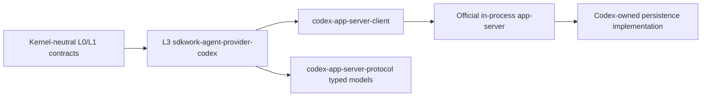

> Owner: SDKWork kernel maintainers
> Updated: 2026-08-01
> Status: **as-built**

# Codex Source Integration

## Decision

The Codex L3 provider embeds the official Rust app-server facade from the
pinned, read-only `external/codex` submodule. Production session and history
access uses `codex-app-server-client` with `codex-app-server-protocol` typed
requests and responses. Kernel does not treat Codex persistence files as an API.

The default is the official in-process client. A separate WebSocket app-server
is not the default because that transport remains an unnecessary process and
experimental boundary for local embedding. Handwritten JSON-RPC duplicates the
official client contract and is also rejected.

## Boundary



- `external/codex` is a fixed gitlink and must remain clean.
- Root Cargo declares upstream path dependencies once; only the owning L3
  provider consumes them.
- Codex types do not enter provider-neutral SPI, server, database, or internal
  HTTP contracts.
- Kernel code does not resolve or open Codex state files by path, issue private
  SQL/PRAGMA queries, or parse rollout JSONL. The L3 host obtains its state
  handle through the official `codex_core::init_state_db` bootstrap API.

## Typed Contract Mapping

| Official operation/type | SDKWork projection |
| --- | --- |
| `ThreadListParams` / `ThreadListResponse` | `CodexSessionPage`; opaque forward/backwards cursors preserved |
| `ThreadReadParams` / `ThreadReadResponse` | `CodexSessionRecord` with complete typed `Thread` |
| `ThreadTurnsListParams` / `ThreadTurnsListResponse` | Complete typed paginated `Turn` response |
| `ThreadItemsListParams` / `ThreadItemsListResponse` | `CodexMessagePage`; each message retains its typed `ThreadItemEntry` |
| `ThreadStatusChanged` | `SessionActivitySnapshot` with approval/user-input waiting hints |

Thread identity, session-tree identity, parent/fork relationships, source,
history mode, status, timestamps, section, working directory, CLI version, Git
metadata, agent nickname/role, and loaded item metrics are projected. The full
typed `Thread` remains available so upstream fields are not flattened away.
The unstable `Thread.path` is deliberately excluded from SDKWork metadata.

All 18 current `ThreadItem` variants map to a Kernel message role and normalized
parts. Every message also carries the complete serialized typed item as a
`TenantSensitive` raw JSON part. Command/file/tool/web/image output is marked
untrusted. Item pages receive the request thread id so `AgentMessage.session_id`
is never lost.

## Runtime And Performance

- The app-server runtime starts lazily on the first thread request.
- Startup loads official Codex configuration and initializes the state handle
  through public Codex APIs; Kernel owns no state path or schema knowledge.
- One process-local client is reused; request IDs are atomic.
- The event loop consumes status notifications independently of requests and
  rejects unsupported interactive server requests explicitly.
- No mutex guard is held across an await.
- List limits are `1..=200`, default 20; no unbounded Kernel history read exists.
- Graceful shutdown is signalled when the runtime owner is dropped.

On Windows, the provider enables `winapi 0.3.9`'s `std` compatibility feature
so the upstream PTY facade and standard `RawHandle` use one `c_void` type. This
is feature unification only; no external source is patched.

## Security And Operations

- Raw provider items are tenant-sensitive.
- External tool and media output is untrusted input to downstream prompts/UI.
- Provider start/request failures use stable internal error codes and safe
  client messages.
- Interactive app-server requests are rejected rather than silently ignored.
- Credentials and configuration are loaded by official Codex configuration;
  Kernel does not manufacture provider auth headers.

The gitlink revision and the generated root lockfile are one upgrade unit.
Upgrades must compile the Codex provider, rerun all variant/cursor contracts,
run clippy, and confirm the external submodule remains clean.

## Verification

```bash
cargo test -p sdkwork-agent-provider-codex
cargo clippy -p sdkwork-agent-provider-codex --all-targets -- -D warnings
cargo fmt -p sdkwork-agent-provider-codex -- --check
node scripts/check-kernel-standards.mjs
node ../sdkwork-specs/tools/check-pagination.mjs --workspace .
git -C external/codex status --short
```
