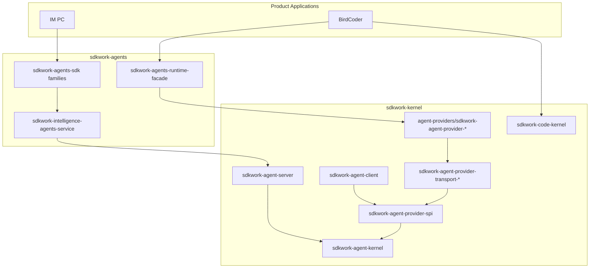

# SDKWork Kernel Technical Architecture

Status: active
Owner: SDKWork kernel maintainers
Updated: 2026-07-08
Specs: [ARCHITECTURE_DECISION_SPEC.md](../../../sdkwork-specs/ARCHITECTURE_DECISION_SPEC.md), [DOCUMENTATION_SPEC.md](../../../sdkwork-specs/DOCUMENTATION_SPEC.md), [RUST_CODE_SPEC.md](../../../sdkwork-specs/RUST_CODE_SPEC.md), [INTERNAL_API_SPEC.md](../../../sdkwork-specs/INTERNAL_API_SPEC.md), [SECURITY_SPEC.md](../../../sdkwork-specs/SECURITY_SPEC.md)

## Document Map

### As-built authority

| Shard | Topic |
| --- | --- |
| [TECH-01-kernel-module-reference.md](TECH-01-kernel-module-reference.md) | Crate reference, entrypoints, env vars, bootstrap sequence |
| [TECH-02-provider-framework-matrix.md](TECH-02-provider-framework-matrix.md) | Framework capability matrix (Codex, Claude Code, Gemini CLI, OpenCode, MiMo Code, OpenClaw, Hermes, Rig) |
| [TECH-03-spi-implementation-gap-tracker.md](TECH-03-spi-implementation-gap-tracker.md) | SPI gaps, commercial scorecard, cross-repo alignment |
| [TECH-2026-06-14-multi-mode-agent-system.md](TECH-2026-06-14-multi-mode-agent-system.md) | Server plugins, client bridge, provider crates |
| [TECH-2026-06-10-agent-execution-loop.md](TECH-2026-06-10-agent-execution-loop.md) | Turn loop, planning, tool execution |
| [TECH-2026-06-10-sdkwork-kernel-plugin-system.md](TECH-2026-06-10-sdkwork-kernel-plugin-system.md) | Kernel plugin manifests and contribution |
| [TECH-2026-06-12-agent-implementation-type.md](TECH-2026-06-12-agent-implementation-type.md) | Implementation typing and registry |
| [TECH-topology-standard.md](TECH-topology-standard.md) | Deployment topology profiles |
| [specs/AGENT_PROVIDER_INTEGRATION_SPEC.md](../../../specs/AGENT_PROVIDER_INTEGRATION_SPEC.md) | Provider integration normative spec |

### Design history and alignment

| Shard | Topic |
| --- | --- |
| [TECH-2026-06-04-external-agent-plugins.md](TECH-2026-06-04-external-agent-plugins.md) | Early external plugin exploration |
| [TECH-2026-06-04-rig-complete-plugin-design.md](TECH-2026-06-04-rig-complete-plugin-design.md) | Rig plugin design draft |
| [TECH-2026-06-10-agent-execution-loop-design.md](TECH-2026-06-10-agent-execution-loop-design.md) | Execution loop design draft |
| [TECH-2026-06-10-sdkwork-kernel-plugin-system-design.md](TECH-2026-06-10-sdkwork-kernel-plugin-system-design.md) | Plugin system design draft |
| [TECH-2026-06-12-sdkwork-specs-structure-hardening.md](TECH-2026-06-12-sdkwork-specs-structure-hardening.md) | Standards structure hardening summary |
| [TECH-2026-06-12-sdkwork-specs-structure-hardening-design.md](TECH-2026-06-12-sdkwork-specs-structure-hardening-design.md) | Standards structure hardening design |
| [TECH-sdkwork-standards-alignment-20260612.md](TECH-sdkwork-standards-alignment-20260612.md) | Standards alignment evidence |

### Superseded (pointer only — do not implement)

- [TECH-2026-06-04-rig-agent-provider-deployments.md](TECH-2026-06-04-rig-agent-provider-deployments.md)
- [TECH-2026-06-04-rig-complete-plugin.md](TECH-2026-06-04-rig-complete-plugin.md)
- [TECH-2026-06-14-multi-mode-agent-system-design.md](TECH-2026-06-14-multi-mode-agent-system-design.md)
- [../desktop-server-architecture.md](../desktop-server-architecture.md) (redirect)
- [../archive/architecture/desktop-server-architecture.md](../archive/architecture/desktop-server-architecture.md)

## 1. Architecture Overview

SDKWork Kernel is a **Rust-first intelligence platform** that provides mechanism-layer
capabilities for agent and code-agent systems. It follows a Linux-kernel-style split:

- **Kernel** (`sdkwork-kernel`) — runtime SPI, provider integration, transport,
  operational server, internal API, client bridge, code kernel.
- **Application** (`sdkwork-agents`) — managed agents, marketplace, product HTTP/SDK.
- **Products** (BirdCoder, IM PC) — consume agents application surfaces; must not
  depend on `sdkwork-agent-provider-*` directly.



### Layering model

| Layer | Crate family | Responsibility |
| --- | --- | --- |
| L0 | `sdkwork-agent-kernel` | Model, tool, skill, session, policy, memory, knowledge, planning, host, protocol, MCP, collaboration, telemetry, task scheduling, agent classification, message query semantics |
| L1 | `sdkwork-agent-provider-spi` | Capability drivers, binding negotiation, transport selection |
| L2 | `sdkwork-agent-provider-transport-*` | Language/runtime transport hosts and workers |
| L3 | `sdkwork-agent-provider-{name}` | Per-framework manifest wiring, bootstrap, adapters |
| L4 | `sdkwork-agents` | Application domain, HTTP routes, SDK families, runtime facade |
| L5 | Product apps | BirdCoder, IM PC, future surfaces |

Dependency rule: **dependencies point inward toward L0**. Products never skip L4
to reach L3.

## 2. Technology Choices

| Concern | Choice | Governing spec |
| --- | --- | --- |
| Primary language | Rust 2021 | [RUST_CODE_SPEC.md](../../../sdkwork-specs/RUST_CODE_SPEC.md) |
| HTTP server | Axum 0.8 via `sdkwork-web-axum` | [WEB_FRAMEWORK_SPEC.md](../../../sdkwork-specs/WEB_FRAMEWORK_SPEC.md) |
| Persistence | SQLx (Postgres/SQLite) | [DATABASE_SPEC.md](../../../sdkwork-specs/DATABASE_SPEC.md) |
| Node transport | Bun/Node worker subprocess | [AGENT_PROVIDER_INTEGRATION_SPEC.md](../../../specs/AGENT_PROVIDER_INTEGRATION_SPEC.md) |
| Python transport | Subprocess + JSON-RPC | [AGENT_PROVIDER_INTEGRATION_SPEC.md](../../../specs/AGENT_PROVIDER_INTEGRATION_SPEC.md) |
| Contract authority | OpenAPI + JSON schemas | [INTERNAL_API_SPEC.md](../../../sdkwork-specs/INTERNAL_API_SPEC.md) |
| Generated SDK | `sdkwork-agent-internal-sdk` | [SDK_SPEC.md](../../../sdkwork-specs/SDK_SPEC.md) |
| Topology | Env profiles | [APP_RUNTIME_TOPOLOGY_SPEC.md](../../../sdkwork-specs/APP_RUNTIME_TOPOLOGY_SPEC.md) |
| Package orchestration | pnpm + Cargo workspace | [PNPM_SCRIPT_SPEC.md](../../../sdkwork-specs/PNPM_SCRIPT_SPEC.md) |

## 3. System Boundaries And Modules

| Area | Primary crates | Detail shard |
| --- | --- | --- |
| Agent runtime core | `sdkwork-agent-kernel`, `sdkwork-agent-session`, `sdkwork-agent-database`, `sdkwork-agent-streaming`, `sdkwork-agent-api-bridge` | [TECH-01-kernel-module-reference.md](TECH-01-kernel-module-reference.md) |
| Provider integration | `sdkwork-agent-provider-spi`, `sdkwork-agent-provider-transport-*`, `agent-providers/crates/sdkwork-agent-provider-*` | [TECH-2026-06-14-multi-mode-agent-system.md](TECH-2026-06-14-multi-mode-agent-system.md) |
| Server and client | `sdkwork-agent-server`, `sdkwork-agent-client`, `sdkwork-routes-agent-internal-*` | [TECH-01-kernel-module-reference.md](TECH-01-kernel-module-reference.md) |
| Code kernel | `sdkwork-code-kernel` | [specs/CODE_KERNEL_SPEC.md](../../../specs/CODE_KERNEL_SPEC.md) |
| Platform plugins | `sdkwork-agent-plugin-core`, Drive, knowledgebase plugins | [TECH-2026-06-10-sdkwork-kernel-plugin-system.md](TECH-2026-06-10-sdkwork-kernel-plugin-system.md) |

## 4. Directory And Package Layout

```text
sdkwork-kernel/
  sdkwork-agent-kernel/           # L0 agent SPI
  sdkwork-code-kernel/            # Code-agent SPI
  sdkwork-agent-provider-spi/     # L1 provider integration SPI
  sdkwork-agent-provider-transport-*/  # L2 transports
  agent-providers/
    crates/sdkwork-agent-provider-{framework}/  # L3 implementations
  bindings/agent-providers/
    {framework}/provider-binding.manifest.json
  sdkwork-agent-server/           # Operational HTTP server
  sdkwork-agent-client/           # Desktop/mobile bridge client
  sdkwork-kernel-plugins/         # Plugin trait + provider-core + platform plugins
  apis/internal-api/              # Internal runtime OpenAPI authority
  sdks/sdkwork-agent-internal-sdk/
  specs/                          # Normative kernel specs
  configs/topology/               # Deployment env profiles
  scripts/
    check-agent-provider-bindings.mjs
    provider-transport-workers/   # Node/Python SDK workers
  external/                       # Upstream source mirrors (submodules)
```

Root layout authority: [SDKWORK_WORKSPACE_SPEC.md](../../../sdkwork-specs/SDKWORK_WORKSPACE_SPEC.md).

## 5. API, SDK, And Data Ownership

### HTTP surfaces

| Surface | Owner | Path prefix |
| --- | --- | --- |
| Internal runtime API | `sdkwork-kernel` | `/internal/v3/api/intelligence/runtime` |
| Agents open API | `sdkwork-agents` | `/agent/v3/api` |
| Agents app API | `sdkwork-agents` | `/app/v3/api` |
| Agents backend API | `sdkwork-agents` | `/backend/v3/api` |

Retired application-local prefixes such as `/api/kernel/*` must not be remounted.

#### Internal runtime API endpoints

The internal runtime API (`/internal/v3/api/intelligence/runtime/*`) exposes the
following operation groups. The authoritative OpenAPI contract lives at
`apis/internal-api/intelligence/sdkwork-agent-internal-api.openapi.yaml`; the
TypeScript SDK is regenerated via `node sdks/workspace-agent-sdkgen.mjs --mode apply`.

| Operation | Method | Path | Aligns with |
| --- | --- | --- | --- |
| `runtime.manifest.get` | GET | `/manifest` | `AGENT_RUNTIME_SPEC` §4 `get_runtime_manifest` / `get_capability_manifest` |
| `runtime.health.get` | GET | `/health` | `AGENT_RUNTIME_SPEC` §4 `get_health` |
| `runtime.diagnostics.get` | GET | `/diagnostics` | `AGENT_RUNTIME_SPEC` §4.1 `get_diagnostics` |
| `runtime.snapshot.load` | GET | `/snapshot` | UI aggregate snapshot |
| `runtime.permissions.decide` | POST | `/permissions/{permissionRequestId}` | `respond_to_permission` |
| `runtime.sessions.create/list` | POST/GET | `/sessions` | `create_session` / `list_sessions` |
| `runtime.sessions.retrieve/delete` | GET/DELETE | `/sessions/{sessionId}` | `get_session` / delete |
| `runtime.sessions.close` | POST | `/sessions/{sessionId}/close` | `close_session` |
| `runtime.sessions.messages.send/list` | POST/GET | `/sessions/{sessionId}/messages` | `send_message` / message query |
| `runtime.sessions.tasks.submit/list` | POST/GET | `/sessions/{sessionId}/tasks` | `create_task` / `list_tasks` |
| `runtime.tasks.retrieve` | GET | `/tasks/{taskId}` | `get_task` |
| `runtime.tasks.cancel` | POST | `/tasks/{taskId}/cancel` | `cancel_task` |
| `runtime.models.list` | GET | `/models` | model catalog |
| `runtime.sessions.model.invoke` | POST | `/sessions/{sessionId}/model/invoke` | model chat |
| `runtime.sessions.tools.list` | GET | `/sessions/{sessionId}/tools` | tool discovery |
| `runtime.sessions.tools.execute` | POST | `/sessions/{sessionId}/tools/{toolName}/execute` | `tool.invoke` |
| `runtime.sessions.events.stream` | GET (SSE) | `/sessions/{sessionId}/events/stream` | `subscribe_events` |

The `/manifest`, `/health`, and `/diagnostics` internal runtime endpoints are
side-effect-free and suitable for UI clients, CI gates, and conformance runners.
The infrastructure probes used by load balancers and orchestrators are
`/healthz`, `/readyz`, and `/livez`; they intentionally return minimal probe
bodies. Internal runtime `/health` combines runtime state with persistence
health and may return `503` with `application/problem+json` when degraded.

### SDK families

| SDK | Owner | Consumers |
| --- | --- | --- |
| `sdkwork-agent-internal-sdk` | Kernel | Server, agents kernel-bridge, privileged clients |
| `sdkwork-agents-sdk` | Agents application | Product apps, consoles |

### Data stores

| Store | Owner | Env prefix |
| --- | --- | --- |
| Runtime session DB | Kernel | `SDKWORK_AGENT_SERVER_DATABASE_*` |
| Client local sessions | Kernel client | `SDKWORK_CLIENT_DATABASE_PATH` |
| Managed agents store | Agents app | `SDKWORK_AGENTS_STORE_DATABASE_*` |

Provider binding negotiation, bootstrap flow, and transport priority are documented in
[TECH-01-kernel-module-reference.md §4–5](TECH-01-kernel-module-reference.md#4-provider-bootstrap-sequence).

Provider binding manifests define both selection and execution. Capabilities
declare `execution_scope`, and selected backends declare `runtime_operations`.
Provider-local lifecycle capabilities such as `sdk.session.lifecycle` and
`sdk.session.history` use provider-core/local SPI state and expose only
`runtime_operations: ["ping"]` through runtime routing. Transport-backed model,
stream, tool, and skill operations require `execution_scope: transport_runtime`
and are rejected before worker invocation when the requested operation is absent
from the selected backend allowlist.

### Agent kernel SPI provider families

The `sdkwork-agent-kernel` crate defines **18 core** and **6 extension** provider
families (see `AGENT_KERNEL_SPEC.md` §3.4). Each core family is registered through
`RuntimeBuilder` and resolved at runtime via `AgentRuntime` accessor methods. The
`RuntimeProviderRegistry` maintains both a primary (first-registered) provider and
a multi-provider list for each family, enabling provider-by-id lookup and
multi-provider fan-out.

| Provider family | SPI trait | Capability IDs | Side-effect profile |
| --- | --- | --- | --- |
| `model` | `ModelProvider` | `model.chat`, `model.catalog`, `model.reasoning`, `model.tool_call`, `model.structured_output`, `model.streaming`, `model.embedding`, `model.cancellation` | External send |
| `tool` | `ToolProvider` | `tool.invoke`, `tool.discovery`, `tool.streaming`, `tool.cancellation` | Side-effectful |
| `policy` | `PolicyProvider` | `policy.evaluate` | Read-only |
| `context` | `ContextProvider` | `context.collect` | Read-only |
| `memory` | `MemoryProvider` | `memory.query`, `memory.write`, `memory.delete`, `memory.export` | Read / Side-effectful / Destructive |
| `knowledge` | `KnowledgeProvider` | `knowledge.search`, `knowledge.read`, `knowledge.list` | Read-only |
| `planning` | `PlanningProvider` | `planning.create` | Read-only |
| `host` | `HostProvider` | `host.filesystem`, `host.process`, `host.network`, `host.secrets` | Read / Side-effectful |
| `protocol_adapter` | `ProtocolAdapter` | `protocol.map`, `protocol.stream` | Read-only |
| `mcp` | `McpProvider` | `mcp.tools`, `mcp.resources`, `mcp.prompts` | Side-effectful / Read-only |
| `skill` | `AgentSkillProvider` | `skill.discover`, `skill.invoke` | Read-only / Side-effectful |
| `collaboration` | `AgentCollaborationProvider` | `agent.discover`, `agent.handoff`, `agent.delegate` | Read-only / External send |
| `telemetry` | `TelemetryProvider` | `telemetry.record` | Side-effectful |
| `task_scheduling` | `TaskSchedulingProvider` | `task.schedule`, `task.cancel`, `task.list`, `task.pause`, `task.resume`, `task.get_due` | Side-effectful / Read-only |
| `agent_classification` | `AgentClassificationProvider` | `agent.classify`, `agent.classification.get`, `agent.classification.list`, `agent.classification.search` | Read-only |
| `message_query` | `MessageQueryProvider` | `message.query`, `message.count`, `message.list_sessions`, `message.search` | Read-only |
| `agent_installer` | `AgentInstaller` | `agent.install`, `agent.uninstall`, `agent.upgrade` | Side-effectful / Destructive |
| `agent_configuration` | `AgentConfigurationProvider` | `agent.configure` | Side-effectful |

Extension families (see `AGENT_KERNEL_SPEC.md` §3.4): `sandbox`, `secret`,
`rate_limit`, `cancellation`, `model_stream`, `backend_health`. Orchestration
primitives and A2A adapters are specified in `MULTI_AGENT_ORCHESTRATION_SPEC.md`
and `A2A_PROTOCOL_ADAPTER_SPEC.md`.

Each capability ID maps to `CapabilityMetadata` (operations, `SideEffectLevel`,
`PolicyCategory`) via the `capability_metadata` function, enabling the policy
layer to enforce fail-closed security decisions based on the side-effect
classification of each operation.

## 6. Security, Privacy, And Observability

### Fail-closed production posture

- `sdkwork-agent-provider-core::mock_policy` gates mock model/tool responses.
- `SDKWORK_KERNEL_ALLOW_MOCK_PROVIDERS=1` is development-only.
- Transport `prepare()` health determines router attachment.
- SDK workers reject fail-open invoke paths when spawn or negotiation fails.
- **Rate limiter**: Redis failures fall back to in-process token buckets
  (fail-closed) rather than allowing requests unconditionally.
- **Tenant token quota**: Uses an atomic **reserve-and-adjust** pattern
  (Redis Lua script) to eliminate the TOCTOU race between quota check and
  usage recording. Reservation is capped by the tenant's configured daily
  limit, and the adjustment phase uses the same reserved amount so small
  quotas cannot drive Redis counters negative. When Redis is unavailable and
  the tenant has a configured quota, requests are rejected with 503 (Service
  Unavailable) to prevent billing abuse during outages.
- **JWKS URL**: Enforced HTTPS in production at both the preflight check
  and the runtime refresh path to prevent MITM key replacement. JWKS refresh
  (file I/O and HTTP fetch) is offloaded to `spawn_blocking` to avoid
  blocking the async runtime.
- **Token fingerprint**: Rate-limit keys for unauthenticated clients use
  SHA-256 (via `sdkwork-utils-rust`) instead of `DefaultHasher`, ensuring
  stable, platform-independent fingerprints.
- **Metrics/Ingress token separation**: Metrics auth no longer auto-falls
  back to the ingress token; a preflight warning is emitted when the same
  token is reused.
- **Security headers**: CSP, HSTS, `X-Content-Type-Options`,
  `X-Frame-Options`, `Referrer-Policy`, and `Permissions-Policy` are set
  on every response.
- **RFC 9457 Problem Details**: All middleware-layer error responses
  (auth failures, rate limiting, identity resolution) return structured
  `application/problem+json` bodies with `type`, `title`, `status`,
  `detail`, and `requestId` fields for machine-readable error handling.
- **SQLite production guard**: Preflight check `runtime_sqlite_scaling`
  returns `Failed` (not `Warning`) when SQLite is selected for production
  scale-out deployments, preventing data corruption from RWO PVC
  multi-replica access.

### Ingress and client auth

- Server: `SDKWORK_KERNEL_INGRESS_AUTH_MODE` via `sdkwork-agent-server`.
- Client remote mode: `sdkwork-agent-client/src/ingress_auth.rs` aligned with server.
- Request IDs use UUID v7 (time-ordered, collision-resistant) instead of
  nanosecond timestamps.
- Permission decisions are persisted to the database `permissions` table,
  surviving server restarts.

Governing standards: [SECURITY_SPEC.md](../../../sdkwork-specs/SECURITY_SPEC.md), [PRIVACY_SPEC.md](../../../sdkwork-specs/PRIVACY_SPEC.md).

### Observability

- Kernel events per `specs/AGENT_EVENT_TELEMETRY_SPEC.md`.
- Product projection to BirdCoder `coding_session_event` per `KERNEL_PRODUCT_PROJECTION_SPEC.md`.
- Runtime diagnostics schema: `specs/schemas/agent-runtime-diagnostics.schema.json`.

Governing standard: [OBSERVABILITY_SPEC.md](../../../sdkwork-specs/OBSERVABILITY_SPEC.md).

## 7. Deployment And Runtime Topology

Application identity: `sdkwork.app.config.json` (`app.key: sdkwork-kernel`).

| Profile | Use case | Key env |
| --- | --- | --- |
| `standalone.development` | Local dev | May allow mock providers |
| `standalone.production` | Private/self-contained production | `SDKWORK_KERNEL_AGENT_PLUGIN=rig`, Postgres, token ingress |
| `cloud.development` | Cloud topology validation | Managed-service URL shape, staging credentials |
| `cloud.production` | Production cloud | `SDKWORK_KERNEL_AGENT_PLUGIN=rig`, Postgres, Redis, token ingress |

Server plugin selection and client bridge builtins: [TECH-01-kernel-module-reference.md §5–6](TECH-01-kernel-module-reference.md#5-client-bridge-builtins).

Topology detail: [TECH-topology-standard.md](TECH-topology-standard.md).

### Production HA posture

- **PostgreSQL enforcement**: Production scale-out deployments must use
  PostgreSQL for session persistence. The preflight check
  `runtime_sqlite_scaling` fails if SQLite is selected, preventing
  RWO PVC data corruption across replicas.
- **PodDisruptionBudget**: `minAvailable: 1` ensures at least one replica
  stays available during voluntary disruptions.
- **Pod anti-affinity**: Soft anti-affinity on `kubernetes.io/hostname`
  spreads pods across nodes for fault isolation.
- **Topology spread constraints**: `maxSkew: 1` on
  `topology.kubernetes.io/zone` ensures cross-zone distribution.
- **Probes**: Startup, readiness, and liveness probes are all configured.
  Readiness checks validate database connectivity.
- **Graceful shutdown**: `shutdown_signal()` returns immediately on
  SIGTERM/SIGINT, allowing axum to start draining in-flight requests.
  A `select!` with `force_close_timer()` enforces a 25-second hard
  deadline; `terminationGracePeriodSeconds: 30` in Kubernetes.
- **SSE timeout isolation**: Standard JSON routes receive a 30-second
  timeout; SSE streaming routes receive a 3600-second timeout. The two
  timeout layers are applied to disjoint sub-routers to prevent the
  shorter timeout from killing SSE connections.
- **SSE connection limit**: Maximum 256 concurrent SSE streams per server
  instance to prevent resource exhaustion. An `AtomicU32` counter with
  `CountedStream` ensures accurate decrement even on abrupt disconnect.
- **HPA**: Scales 2–6 replicas based on CPU and memory utilization with
  stabilization windows for scale-up (30 s) and scale-down (300 s).
  Custom metric annotations document Prometheus-exported metric names
  for optional prometheus-adapter integration.
- **NetworkPolicy**: Restricts ingress to the ingress controller and kubelet;
  egress limited to DNS, HTTPS, Redis, PostgreSQL, and OTEL collector.
- **PreStop hook**: 5-second sleep to allow load balancer deregistration
  before the container receives SIGTERM.

### Performance architecture

- **RuntimeState**: Uses `RwLock` instead of `Mutex` to allow concurrent
  local bridge reads (model request preparation, model/tool catalog lookup)
  while serializing writes (session registration, message state updates). Model
  invoke, stream, cancel, and message-turn paths clone the model bridge or build
  the session-scoped request under the bridge lock, then execute provider calls
  outside the lock so slow provider I/O does not block unrelated bridge
  mutations. Message turns retain a per-session mutex so concurrent turns in
  the same session do not interleave user and assistant messages. Session close
  and delete paths release bridge-owned session/history/event state and the
  per-session turn lock. Bridge event snapshots are bounded per session and
  globally, so high-churn short sessions do not leave unbounded transient
  runtime entries behind.
- **PersistenceState**: Uses `Arc<UnifiedSessionManager>` instead of
  `Arc<Mutex<...>>` — the session manager methods take `&self`, and
  underlying repositories handle their own concurrency (SQLite internal
  Mutex, Postgres connection pool). Blocking persistence operations
  are offloaded via `spawn_blocking`. Cross-table message append is
  transactional and idempotent across SQLite/PostgreSQL: retrying the same
  `message_id` in one session does not double-increment `message_count` or
  create a second persisted event, while changed duplicate payloads or a
  duplicate `message_id` targeting another session are rejected before event
  publication. Standalone `save_message` keeps the same immutable identity
  rule across SQLite, PostgreSQL, and the typed in-memory test adapter.
- **Rate limiter**: O(1) LRU eviction via insertion-order queue instead of
  O(n) scan.
- **SSE events**: Replay events are assigned sequential indices 0..N,
  and live events continue from N onward within a single connection.
  Clients use `event_id` for deduplication across reconnections.
- **SSE connection cap**: `AtomicU32` counter enforces a per-server
  maximum of 256 concurrent streams with RAII decrement via
  `CountedStream`.
- **Model stream provider state**: In-memory stream provider slots are released
  by `finalize_stream`, so completed streams do not keep occupying
  `max_concurrent` capacity in long-running runtimes.
- **Token quota**: Atomic Lua-script-based reservation eliminates the
  TOCTOU race; pre-reserved tokens are adjusted to actual usage after
  model invocation completes using the same bounded reservation amount.
  Zero-quota tenants fail before invocation and do not accrue adjustment usage.
- **List pagination**: List endpoints use `page` and `page_size` query parameters
  (default page size 20, max 200) with offset-mode `PageInfo` in
  `SdkWorkApiResponse` envelopes per `PAGINATION_SPEC.md`.
- **sdkwork-utils-rust**: Shared utility library provides SHA-256,
  HMAC, AES-256-GCM, HKDF, and ID generation to reduce cross-crate
  code duplication.

## 8. Ecosystem And Sibling Applications

Kernel is one layer in the SDKWork agent platform. Products **must** consume agent
runtime through `sdkwork-agents`; BirdCoder additionally owns code-workbench
product routes and `sdkwork-code-kernel` semantics.

| Repository | Role | Kernel relationship |
| --- | --- | --- |
| `sdkwork-agents` | Managed agents, `ai_*` store, open/app/backend APIs, runtime facade | Merges kernel internal router via kernel-bridge |
| `sdkwork-birdcoder` | Multi engine IDE (Codex, Claude Code, OpenCode, …) | `sdkwork-agents-runtime-facade` only — no `sdkwork-agent-provider-*` |
| `sdkwork-memory`, `sdkwork-knowledgebase`, … | Capability modules | Referenced by agents composition slots |

Canon: [PRD-04-ecosystem-architecture.md](../../product/prd/PRD-04-ecosystem-architecture.md).

Framework comparison: [TECH-02-provider-framework-matrix.md](TECH-02-provider-framework-matrix.md).

SPI gap and commercial scorecard: [TECH-03-spi-implementation-gap-tracker.md](TECH-03-spi-implementation-gap-tracker.md).

## 9. Architecture Decision Index

| ID | Title | Status |
| --- | --- | --- |
| [ADR-20260626](../decisions/ADR-20260626-agent-provider-integration-naming.md) | Agent provider integration naming | Accepted |
| [ADR-20260626](../decisions/ADR-20260626-agents-application-layer-separation.md) | Agents application layer separation | Accepted |
| [ADR-20260622](../decisions/ADR-20260622-sdkwork-internal-api-surface.md) | Internal API surface | Accepted |
| [ADR-20260618](../decisions/ADR-20260618-platform-framework-adoption.md) | Platform framework adoption | Accepted |
| [ADR-20260612](../decisions/ADR-20260612-agent-implementation-type.md) | Agent implementation type | Accepted |
| [ADR-20260612](../decisions/ADR-20260612-sdkwork-kernel-root-dictionary.md) | Kernel root dictionary | Accepted |
| [ADR-20260628](../decisions/ADR-20260628-KERNEL-SPI-COMPREHENSIVE-ASSESSMENT.md) | SPI comprehensive assessment | Accepted |

## 10. Verification

### Kernel workspace

```bash
cargo test --workspace
cargo build --workspace
node scripts/check-agent-provider-bindings.mjs
node scripts/check-kernel-standards.mjs
node --test sdkwork-kernel-plugins/tests/kernel_plugin_structure.test.mjs
node ../../../sdkwork-specs/tools/check-repository-docs-standard.mjs --root .
```

### Provider transport workers

```bash
# Credential-free SDK resolver and fail-closed contract.
# Unbuilt external source mirrors are not treated as live SDK packages.
# Runtime operations must be declared by the selected backend runtime_operations allowlist.
node scripts/provider-transport-workers/engine-sdk-live.test.mjs

# Hermes Python worker fail-closed contract
node scripts/provider-transport-workers/generic-python-sdk-worker.test.mjs

# Staging live SDK/gateway proof with real credentials.
# OpenClaw uses OPENCLAW_GATEWAY_URL instead of a required local npm import.
SDKWORK_KERNEL_STAGING_LIVE_SDK=1 SDKWORK_KERNEL_STAGING_REQUIRE_CREDENTIALS=1 node scripts/provider-transport-workers/engine-sdk-live-staging.mjs --framework all
```

### Cross-repo

```bash
# sdkwork-agents
cargo test -p sdkwork-agents-runtime-facade

# sdkwork-birdcoder
cargo test -p sdkwork-birdcoder-kernel-bridge
node scripts/kernel-birdcoder-alignment-contract.test.mjs
```

### Topology

```bash
pnpm test:topology
```

Staging live invokes require real upstream credentials or gateway endpoints and
are not part of default `pnpm verify`. The current staging live gate covers
Node SDK and gateway-backed providers: Codex, Claude Code, Gemini CLI, and
OpenCode require importable SDK packages, while OpenClaw proves the gateway HTTP
authority through `OPENCLAW_GATEWAY_URL`. Hermes Python/TUI gateway live proof is
a separate GA prerequisite.
