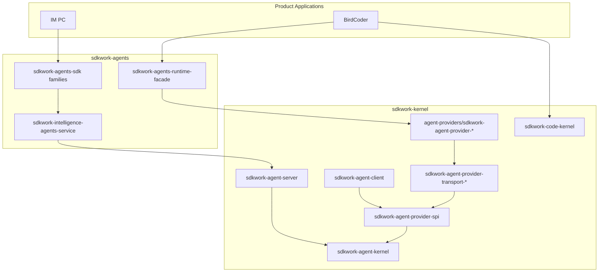

# SDKWork Kernel Technical Architecture

Status: active
Owner: SDKWork kernel maintainers
Updated: 2026-06-26
Specs: [ARCHITECTURE_DECISION_SPEC.md](../../../sdkwork-specs/ARCHITECTURE_DECISION_SPEC.md), [DOCUMENTATION_SPEC.md](../../../sdkwork-specs/DOCUMENTATION_SPEC.md), [RUST_CODE_SPEC.md](../../../sdkwork-specs/RUST_CODE_SPEC.md), [INTERNAL_API_SPEC.md](../../../sdkwork-specs/INTERNAL_API_SPEC.md), [SECURITY_SPEC.md](../../../sdkwork-specs/SECURITY_SPEC.md)

## Document Map

### As-built authority

| Shard | Topic |
| --- | --- |
| [TECH-01-kernel-module-reference.md](TECH-01-kernel-module-reference.md) | Crate reference, entrypoints, env vars, bootstrap sequence |
| [TECH-2026-06-14-multi-mode-agent-system.md](TECH-2026-06-14-multi-mode-agent-system.md) | Server plugins, client bridge, provider crates |
| [TECH-2026-06-10-agent-execution-loop.md](TECH-2026-06-10-agent-execution-loop.md) | Turn loop, planning, tool execution |
| [TECH-2026-06-10-sdkwork-kernel-plugin-system.md](TECH-2026-06-10-sdkwork-kernel-plugin-system.md) | Kernel plugin manifests and contribution |
| [TECH-2026-06-12-agent-implementation-type.md](TECH-2026-06-12-agent-implementation-type.md) | Implementation typing and registry |
| [TECH-topology-standard.md](TECH-topology-standard.md) | Deployment topology profiles |
| [specs/AGENT_PROVIDER_INTEGRATION_SPEC.md](../../../specs/AGENT_PROVIDER_INTEGRATION_SPEC.md) | Provider integration normative spec |

### Design history and alignment

| Shard | Topic |
| --- | --- |
| [TECH-2026-06-04-external-agent-plugins.md](TECH-2026-06-04-external-agent-plugins.md) | Early external plugin exploration |
| [TECH-2026-06-04-rig-complete-plugin-design.md](TECH-2026-06-04-rig-complete-plugin-design.md) | Rig plugin design draft |
| [TECH-2026-06-10-agent-execution-loop-design.md](TECH-2026-06-10-agent-execution-loop-design.md) | Execution loop design draft |
| [TECH-2026-06-10-sdkwork-kernel-plugin-system-design.md](TECH-2026-06-10-sdkwork-kernel-plugin-system-design.md) | Plugin system design draft |
| [TECH-2026-06-12-sdkwork-specs-structure-hardening.md](TECH-2026-06-12-sdkwork-specs-structure-hardening.md) | Standards structure hardening summary |
| [TECH-2026-06-12-sdkwork-specs-structure-hardening-design.md](TECH-2026-06-12-sdkwork-specs-structure-hardening-design.md) | Standards structure hardening design |
| [TECH-sdkwork-standards-alignment-20260612.md](TECH-sdkwork-standards-alignment-20260612.md) | Standards alignment evidence |

### Superseded (pointer only — do not implement)

- [TECH-2026-06-04-rig-agent-provider-deployments.md](TECH-2026-06-04-rig-agent-provider-deployments.md)
- [TECH-2026-06-04-rig-complete-plugin.md](TECH-2026-06-04-rig-complete-plugin.md)
- [TECH-2026-06-14-multi-mode-agent-system-design.md](TECH-2026-06-14-multi-mode-agent-system-design.md)
- [../desktop-server-architecture.md](../desktop-server-architecture.md) (redirect)
- [../archive/architecture/desktop-server-architecture.md](../archive/architecture/desktop-server-architecture.md)

## 1. Architecture Overview

SDKWork Kernel is a **Rust-first intelligence platform** that provides mechanism-layer
capabilities for agent and code-agent systems. It follows a Linux-kernel-style split:

- **Kernel** (`sdkwork-kernel`) — runtime SPI, provider integration, transport,
  operational server, internal API, client bridge, code kernel.
- **Application** (`sdkwork-agents`) — managed agents, marketplace, product HTTP/SDK.
- **Products** (BirdCoder, IM PC) — consume agents application surfaces; must not
  depend on `sdkwork-agent-provider-*` directly.



### Layering model

| Layer | Crate family | Responsibility |
| --- | --- | --- |
| L0 | `sdkwork-agent-kernel` | Model, tool, skill, session, policy semantics |
| L1 | `sdkwork-agent-provider-spi` | Capability drivers, binding negotiation, transport selection |
| L2 | `sdkwork-agent-provider-transport-*` | Language/runtime transport hosts and workers |
| L3 | `sdkwork-agent-provider-{name}` | Per-framework manifest wiring, bootstrap, adapters |
| L4 | `sdkwork-agents` | Application domain, HTTP routes, SDK families, runtime facade |
| L5 | Product apps | BirdCoder, IM PC, future surfaces |

Dependency rule: **dependencies point inward toward L0**. Products never skip L4
to reach L3.

## 2. Technology Choices

| Concern | Choice | Governing spec |
| --- | --- | --- |
| Primary language | Rust 2021 | [RUST_CODE_SPEC.md](../../../sdkwork-specs/RUST_CODE_SPEC.md) |
| HTTP server | Axum 0.8 via `sdkwork-web-axum` | [WEB_FRAMEWORK_SPEC.md](../../../sdkwork-specs/WEB_FRAMEWORK_SPEC.md) |
| Persistence | SQLx (Postgres/SQLite) | [DATABASE_SPEC.md](../../../sdkwork-specs/DATABASE_SPEC.md) |
| Node transport | Bun/Node worker subprocess | [AGENT_PROVIDER_INTEGRATION_SPEC.md](../../../specs/AGENT_PROVIDER_INTEGRATION_SPEC.md) |
| Python transport | Subprocess + JSON-RPC | [AGENT_PROVIDER_INTEGRATION_SPEC.md](../../../specs/AGENT_PROVIDER_INTEGRATION_SPEC.md) |
| Contract authority | OpenAPI + JSON schemas | [INTERNAL_API_SPEC.md](../../../sdkwork-specs/INTERNAL_API_SPEC.md) |
| Generated SDK | `sdkwork-agent-internal-sdk` | [SDK_SPEC.md](../../../sdkwork-specs/SDK_SPEC.md) |
| Topology | Env profiles | [APP_RUNTIME_TOPOLOGY_SPEC.md](../../../sdkwork-specs/APP_RUNTIME_TOPOLOGY_SPEC.md) |
| Package orchestration | pnpm + Cargo workspace | [PNPM_SCRIPT_SPEC.md](../../../sdkwork-specs/PNPM_SCRIPT_SPEC.md) |

## 3. System Boundaries And Modules

| Area | Primary crates | Detail shard |
| --- | --- | --- |
| Agent runtime core | `sdkwork-agent-kernel`, `sdkwork-agent-session`, `sdkwork-agent-database`, `sdkwork-agent-streaming`, `sdkwork-agent-api-bridge` | [TECH-01-kernel-module-reference.md](TECH-01-kernel-module-reference.md) |
| Provider integration | `sdkwork-agent-provider-spi`, `sdkwork-agent-provider-transport-*`, `agent-providers/crates/sdkwork-agent-provider-*` | [TECH-2026-06-14-multi-mode-agent-system.md](TECH-2026-06-14-multi-mode-agent-system.md) |
| Server and client | `sdkwork-agent-server`, `sdkwork-agent-client`, `sdkwork-routes-agent-internal-*` | [TECH-01-kernel-module-reference.md](TECH-01-kernel-module-reference.md) |
| Code kernel | `sdkwork-code-kernel` | [specs/CODE_KERNEL_SPEC.md](../../../specs/CODE_KERNEL_SPEC.md) |
| Platform plugins | `sdkwork-agent-plugin-core`, Drive, knowledgebase plugins | [TECH-2026-06-10-sdkwork-kernel-plugin-system.md](TECH-2026-06-10-sdkwork-kernel-plugin-system.md) |

## 4. Directory And Package Layout

```text
sdkwork-kernel/
  sdkwork-agent-kernel/           # L0 agent SPI
  sdkwork-code-kernel/            # Code-agent SPI
  sdkwork-agent-provider-spi/     # L1 provider integration SPI
  sdkwork-agent-provider-transport-*/  # L2 transports
  agent-providers/
    crates/sdkwork-agent-provider-{framework}/  # L3 implementations
  bindings/agent-providers/
    {framework}/provider-binding.manifest.json
  sdkwork-agent-server/           # Operational HTTP server
  sdkwork-agent-client/           # Desktop/mobile bridge client
  sdkwork-kernel-plugins/         # Plugin trait + provider-core + platform plugins
  apis/internal-api/              # Internal runtime OpenAPI authority
  sdks/sdkwork-agent-internal-sdk/
  specs/                          # Normative kernel specs
  configs/topology/               # Deployment env profiles
  scripts/
    check-agent-provider-bindings.mjs
    provider-transport-workers/   # Node/Python SDK workers
  external/                       # Upstream source mirrors (submodules)
```

Root layout authority: [SDKWORK_WORKSPACE_SPEC.md](../../../sdkwork-specs/SDKWORK_WORKSPACE_SPEC.md).

## 5. API, SDK, And Data Ownership

### HTTP surfaces

| Surface | Owner | Path prefix |
| --- | --- | --- |
| Internal runtime API | `sdkwork-kernel` | `/internal/v3/api/intelligence/runtime` |
| Agents open API | `sdkwork-agents` | `/agent/v3/api` |
| Agents app API | `sdkwork-agents` | `/app/v3/api` |
| Agents backend API | `sdkwork-agents` | `/backend/v3/api` |

Retired application-local prefixes such as `/api/kernel/*` must not be remounted.

### SDK families

| SDK | Owner | Consumers |
| --- | --- | --- |
| `sdkwork-agent-internal-sdk` | Kernel | Server, agents kernel-bridge, privileged clients |
| `sdkwork-agents-sdk` | Agents application | Product apps, consoles |

### Data stores

| Store | Owner | Env prefix |
| --- | --- | --- |
| Runtime session DB | Kernel | `SDKWORK_AGENT_SERVER_DATABASE_*` |
| Client local sessions | Kernel client | `SDKWORK_CLIENT_DATABASE_PATH` |
| Managed agents store | Agents app | `SDKWORK_AGENTS_STORE_DATABASE_*` |

Provider binding negotiation, bootstrap flow, and transport priority are documented in
[TECH-01-kernel-module-reference.md §4–5](TECH-01-kernel-module-reference.md#4-provider-bootstrap-sequence).

## 6. Security, Privacy, And Observability

### Fail-closed production posture

- `sdkwork-agent-provider-core::mock_policy` gates mock model/tool responses.
- `SDKWORK_KERNEL_ALLOW_MOCK_PROVIDERS=1` is development-only.
- Transport `prepare()` health determines router attachment.
- SDK workers reject fail-open invoke paths when spawn or negotiation fails.

### Ingress and client auth

- Server: `SDKWORK_KERNEL_INGRESS_AUTH_MODE` via `sdkwork-agent-server`.
- Client remote mode: `sdkwork-agent-client/src/ingress_auth.rs` aligned with server.

Governing standards: [SECURITY_SPEC.md](../../../sdkwork-specs/SECURITY_SPEC.md), [PRIVACY_SPEC.md](../../../sdkwork-specs/PRIVACY_SPEC.md).

### Observability

- Kernel events per `specs/AGENT_EVENT_TELEMETRY_SPEC.md`.
- Product projection to BirdCoder `coding_session_event` per `KERNEL_PRODUCT_PROJECTION_SPEC.md`.
- Runtime diagnostics schema: `specs/schemas/agent-runtime-diagnostics.schema.json`.

Governing standard: [OBSERVABILITY_SPEC.md](../../../sdkwork-specs/OBSERVABILITY_SPEC.md).

## 7. Deployment And Runtime Topology

Application identity: `sdkwork.app.config.json` (`app.key: sdkwork-kernel`).

| Profile | Use case | Key env |
| --- | --- | --- |
| `standalone.split-services.development` | Local dev | May allow mock providers |
| `cloud.split-services.production` | Production | `SDKWORK_KERNEL_AGENT_PLUGIN=rig`, Postgres, token ingress |

Server plugin selection and client bridge builtins: [TECH-01-kernel-module-reference.md §5–6](TECH-01-kernel-module-reference.md#5-client-bridge-builtins).

Topology detail: [TECH-topology-standard.md](TECH-topology-standard.md).

## 8. Architecture Decision Index

| ID | Title | Status |
| --- | --- | --- |
| [ADR-20260626](../decisions/ADR-20260626-agent-provider-integration-naming.md) | Agent provider integration naming | Accepted |
| [ADR-20260626](../decisions/ADR-20260626-agents-application-layer-separation.md) | Agents application layer separation | Accepted |
| [ADR-20260622](../decisions/ADR-20260622-sdkwork-internal-api-surface.md) | Internal API surface | Accepted |
| [ADR-20260618](../decisions/ADR-20260618-platform-framework-adoption.md) | Platform framework adoption | Accepted |
| [ADR-20260612](../decisions/ADR-20260612-agent-implementation-type.md) | Agent implementation type | Accepted |
| [ADR-20260612](../decisions/ADR-20260612-sdkwork-kernel-root-dictionary.md) | Kernel root dictionary | Accepted |

## 9. Verification

### Kernel workspace

```bash
cargo test --workspace
cargo build --workspace
node scripts/check-agent-provider-bindings.mjs
node scripts/check-kernel-standards.mjs
node --test sdkwork-kernel-plugins/tests/kernel_plugin_structure.test.mjs
node ../../../sdkwork-specs/tools/check-repository-docs-standard.mjs --root .
```

### Provider transport workers

```bash
node scripts/provider-transport-workers/engine-sdk-live.test.mjs
```

### Cross-repo

```bash
# sdkwork-agents
cargo test -p sdkwork-agents-runtime-facade

# sdkwork-birdcoder
cargo test -p sdkwork-birdcoder-kernel-bridge
node scripts/kernel-birdcoder-alignment-contract.test.mjs
```

### Topology

```bash
pnpm test:topology
```

Optional live SDK invokes require real upstream credentials and are not part of
default `pnpm verify`.
