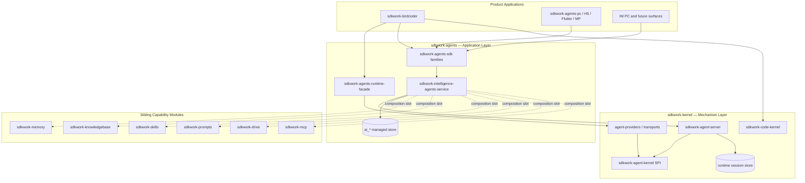

# SDKWork Kernel — Ecosystem Architecture (Kernel · Agents · BirdCoder)

Status: active
Owner: SDKWork kernel maintainers
Application: sdkwork-kernel
Updated: 2026-07-06
Parent: [PRD.md](PRD.md)
Specs: [MODULE_SPEC.md](../../../../sdkwork-specs/MODULE_SPEC.md), [APPLICATION_SPEC.md](../../../../sdkwork-specs/APPLICATION_SPEC.md), [API_SPEC.md](../../../../sdkwork-specs/API_SPEC.md)

## 1. Purpose

This shard defines how **sdkwork-kernel**, **sdkwork-agents**, and **sdkwork-birdcoder**
compose into a commercial agent platform. It is the product-facing map for
dependency rules, data ownership, and API surfaces. Normative SPI contracts
remain in `specs/`; sibling application depth lives in each repository's Canon.

## 2. Three-Repository Model

## 3. Responsibility Matrix

| Concern | Owner | Must not own |
| --- | --- | --- |
| Agent SPI (18 core + 6 extension families) | `sdkwork-kernel` | Business CRUD, tenant policy, marketplace |
| Provider binding & transport | `sdkwork-kernel` | Agent catalog tables |
| Runtime transient state (active session, SSE cursor, in-flight task) | `sdkwork-kernel` (`sdkwork-agent-database`) | Long-term session archive, agent config catalog |
| Internal runtime HTTP `/internal/v3/api/intelligence/runtime/*` | `sdkwork-kernel` | `/app`, `/backend`, `/agent` product APIs |
| Code-agent SPI (workspace, patch, terminal, VCS) | `sdkwork-code-kernel` | BirdCoder product routes |
| Managed agent identity, composition, audit | `sdkwork-agents` (`ai_*` tables) | Kernel provider crates |
| Open / App / Backend HTTP + SDK families | `sdkwork-agents` | Direct `sdkwork-agent-provider-*` in products |
| Memory tier implementations (permanent, user, growth) | `sdkwork-memory` (+ agents composition) | Kernel `MemoryProvider` SPI definition only |
| Knowledge, skills, prompts, files, MCP catalogs | Sibling modules | Duplicate tables in agents |
| Multi code-engine IDE (Codex, Claude Code, OpenCode, …) | `sdkwork-birdcoder` | Agent runtime SPI, provider adapters |
| Coding session UX, workbench, engine catalog UI | `sdkwork-birdcoder` | Managed agent CRUD |

## 4. Dependency Rules (Hard)

| From | To | Rule |
| --- | --- | --- |
| `sdkwork-birdcoder` | `sdkwork-agents-runtime-facade` / agents SDK | **Required** for agent turns and engine bootstrap |
| `sdkwork-birdcoder` | `sdkwork-agent-kernel`, `sdkwork-agent-provider-*` | **Forbidden** — use kernel-bridge + agents facade only |
| `sdkwork-agents-pc` | `@sdkwork/agents-app-sdk` | **Required** — composed consumer facade |
| `sdkwork-agents` | `sdkwork-agent-internal-sdk` | **Allowed** — kernel-bridge merges operational router |
| Any product app | `sdkwork-agent-provider-*` | **Forbidden** |
| `sdkwork-kernel` | `sdkwork-agents` business tables | **Forbidden** |
| `sdkwork-agents` | Sibling modules | **Via composition slot** — no deep duplication |

Evidence gates: `sdkwork-birdcoder/scripts/kernel-birdcoder-alignment-contract.test.mjs`,
`sdkwork-agents/tools/check_sdkwork_agents_architecture_alignment.mjs`.

## 5. Agent Framework Taxonomy

Kernel integrates frameworks through **one provider crate + one binding manifest**
per framework. Products select engines through **agents runtime facade**, not
kernel env alone.

| Class | Frameworks | Execution model | Primary SDK path |
| --- | --- | --- | --- |
| Code-agent CLI | Codex, Claude Code, Gemini CLI, OpenCode, Mimo Code | Tool + workspace loop, approval gates | Official SDK / rust crate / IPC when declared in binding |
| Autonomous gateway | OpenClaw, Hermes | Long-lived agent, channels, plugins | TypeScript plugin SDK / Python gateway / JSON-RPC |
| Framework-native | Rig | In-process Rust agent graph | `rig-core` rust_native |
| Kernel default host | Rig (server plugin) | Hosted operational runtime | Kernel plugin manifest |

Detail matrix: [TECH-02-provider-framework-matrix.md](../../architecture/tech/TECH-02-provider-framework-matrix.md).

## 6. Memory Model Split

| Layer | Responsibility |
| --- | --- |
| Kernel `MemoryProvider` SPI | Tier (`Ephemeral`, `ShortTerm`, `LongTerm`, `Permanent`, `Growing`), scope (`Session`, `User`, `Tenant`, `Organization`, `Agent`, `Application`), query/write/delete/export contracts |
| `sdkwork-memory` | Concrete backends (vector, graph, plugin providers), persistence tables |
| `sdkwork-agents` | Composition slot `slot_kind: memory` → binds agent to memory profile |
| Runtime session store (kernel) | Transient turn buffers only — not business memory archive |

Kernel **defines** memory semantics; agents **binds** memory products; memory module **implements**.

## 7. API And SDK Surfaces

| Surface | Prefix | Owner | Consumer |
| --- | --- | --- | --- |
| Internal runtime | `/internal/v3/api/intelligence/runtime` | Kernel | Agents kernel-bridge, privileged ops |
| Open API | `/agent/v3/api` | Agents | Third-party integrators |
| App API | `/app/v3/api` | Agents | PC, H5, Flutter, Mini Program, BirdCoder app routes |
| Backend API | `/backend/v3/api` | Agents | Admin console |
| BirdCoder app API | `/app/v3/api` (birdcoder-owned routes) | BirdCoder | Workbench, coding sessions |

Complete agents operation list (70 HTTP operations): `sdkwork-agents/docs/architecture/tech/TECH-api-specification.md`.

All L2+ business APIs use `SdkWorkApiResponse` + `ProblemDetail` per `API_SPEC.md` §4.5.

## 8. BirdCoder Integration Contract

BirdCoder is the **proving application** for code-agent kernel + multi-engine management.

| BirdCoder owns | Consumes from agents/kernel |
| --- | --- |
| Workbench UI, Monaco, terminal, project/workspace routes | `sdkwork-agents-runtime-facade` for engine turns |
| `sdkwork-code-kernel` for patch/terminal/VCS semantics | Agents app SDK for managed agent/session when needed |
| `sdkwork-birdcoder-kernel-bridge` (projection only) | Kernel event → `coding_session_event` projection |
| Engine catalog UI | Facade engine list — not direct provider registry |

Frozen boundary docs (BirdCoder repo): `TECH-30-kernel-birdcoder-boundariesstandard.md`,
`TECH-33-agents-birdcoder-boundariesstandard.md`.

When BirdCoder needs a capability missing from agents APIs, **extend agents first** —
do not add a product → kernel shortcut.

## 9. Commercial Platform Checklist

| Gate | Status | Owner |
| --- | --- | --- |
| Workspace tests green | Done | Kernel + Agents |
| Provider binding catalog | Done | Kernel |
| Product → provider forbidden edges | Enforced by contract tests | All repos |
| Agents 70-operation API + SDK generation | Done | Agents |
| Postgres production path for managed store | Required for scale-out | Agents |
| Live official SDK invokes (staging) | Optional gate | Kernel |
| SPI P0 gaps (sandbox wiring, A2A adapter, provider health loop in production router) | Partial — see gap tracker | Kernel |
| Published artifact registry / SBOM | Pending P4 | Release |

Gap detail: [TECH-03-spi-implementation-gap-tracker.md](../../architecture/tech/TECH-03-spi-implementation-gap-tracker.md),
[PRD-03-commercial-readiness-baseline.md](PRD-03-commercial-readiness-baseline.md).

## 10. Related Canon

| Document | Repository |
| --- | --- |
| [TECH_ARCHITECTURE.md](../../architecture/tech/TECH_ARCHITECTURE.md) | sdkwork-kernel |
| [TECH-api-specification.md](../../../../sdkwork-agents/docs/architecture/tech/TECH-api-specification.md) | sdkwork-agents |
| [AGENTS_LAYERING.md](../../../../sdkwork-agents/docs/architecture/AGENTS_LAYERING.md) | sdkwork-agents |
| [TECH-30-kernel-birdcoder-boundariesstandard.md](../../../../sdkwork-birdcoder/docs/architecture/tech/TECH-30-kernel-birdcoder-boundariesstandard.md) | sdkwork-birdcoder |
